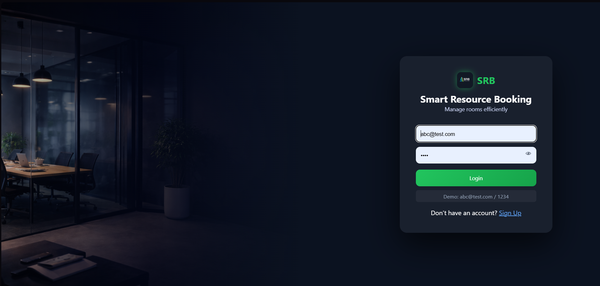
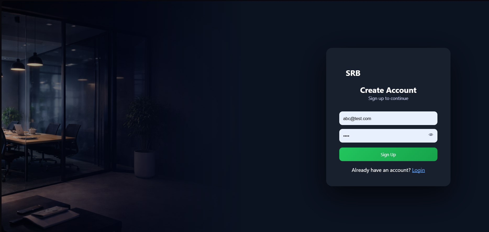
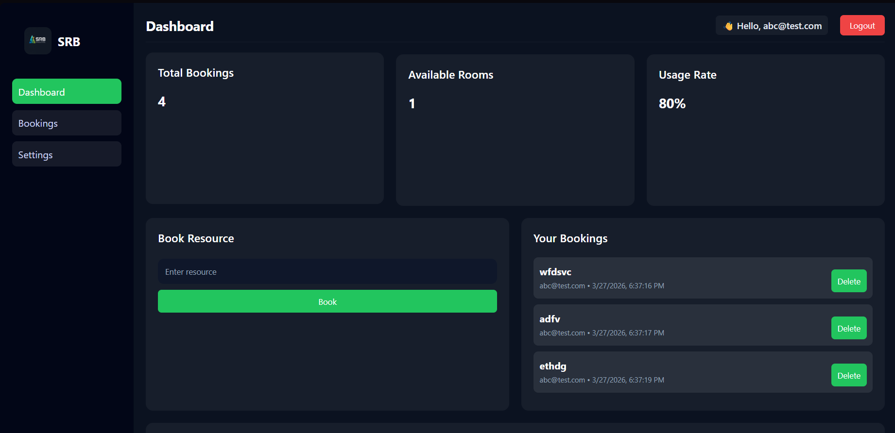
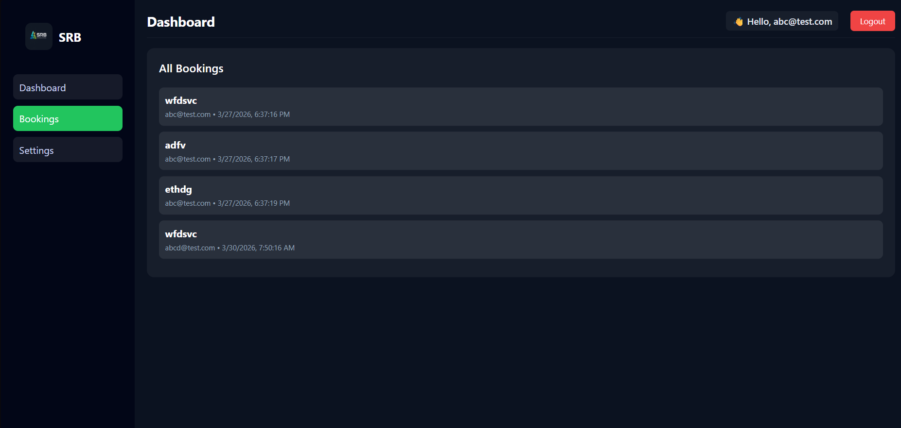
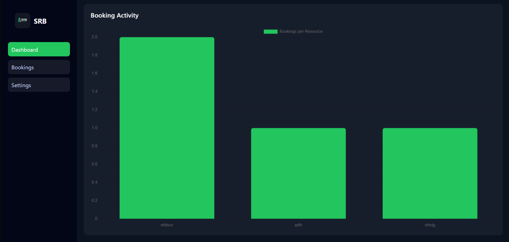
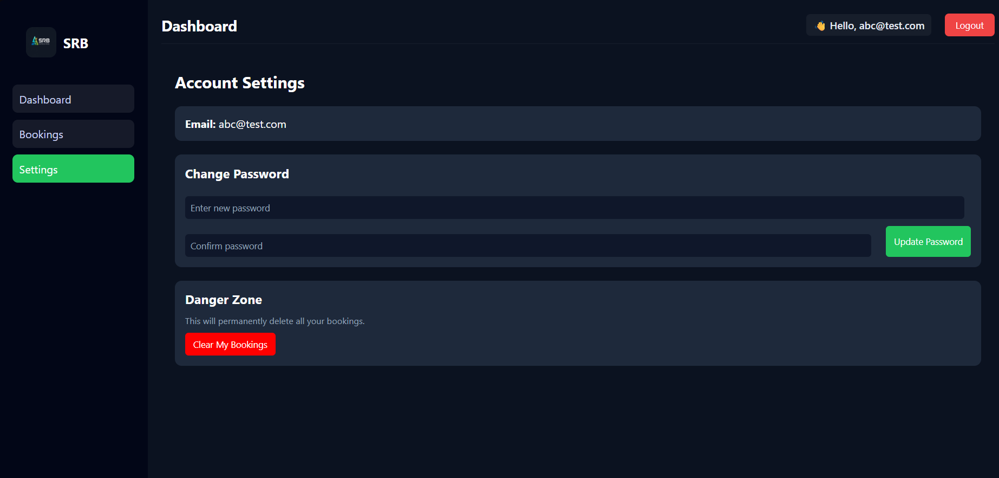

# Smart Resource Booking (SRB)

A dynamic web application to manage and book shared resources like rooms.
Built using HTML, CSS, and JavaScript with an interactive dashboard.

---

## 🔗 Live Demo

https://resource-scheduler-webapp.vercel.app

---

## 📌 Features

### 👤 Authentication

* User signup and login system
* Basic password validation
* Data stored using browser localStorage

### 📊 Dashboard

* Displays total bookings
* Shows available rooms dynamically
* Calculates usage percentage
* Interactive booking activity chart using Chart.js

### 📅 Booking System

* Users can book resources
* View their bookings in the dashboard
* Delete bookings with confirmation
* Prevent invalid inputs

### 📋 Bookings Overview

* Displays all bookings stored in the system
* Shows booking details including user and time

### ⚙️ Settings

* Change password with validation
* Password strength indicator
* Option to clear all bookings

---

## 🧪 Demo Credentials

```
Email: abc@test.com  
Password: 1234
```

Or create a new account using the signup page.

---

## 🧰 Tech Stack

* HTML
* CSS
* JavaScript
* Chart.js
* LocalStorage

---

## 📸 Screenshots

### 🔐 Login Page


---

### 📝 Sign Up Page


---

### 📊 Dashboard Overview


---

### 📅 My Bookings


---

### 📈 Booking Activity Chart


---

### ⚙️ Settings Page


---

## ⚙️ How It Works

* User data and bookings are stored in localStorage
* Each user’s bookings are tracked separately
* Dashboard updates dynamically based on stored data
* Charts visualize booking activity

---

## ⚠️ Limitations

* No backend (data is stored locally)
* No real authentication security
* Data is browser-specific
* All bookings are visible in the system (no role-based access)

---

## 🚀 Future Improvements

* Add admin and user role separation
* Restrict booking visibility per user
* Backend integration (Node.js / Firebase)
* Time-slot based booking system
* Notifications instead of alerts

---

## 👤 Author

Anant Agarwal
